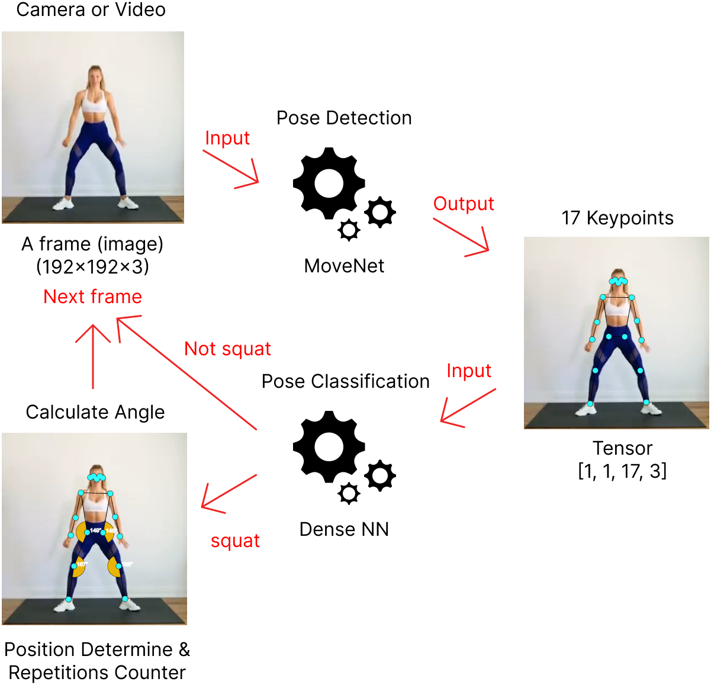

# StrideX
A web application to help everyone work out wherever and whenever. Supported by the pose detection feature to analyze every pose and auto count the number of repetitions made. So, let's lead a healthy lifestyle by working out every day!


Pose Detection and Classification in the AI Workout Assistant application fully runs on the Client side, so no image data comes out of the user's device. Videos or images processed by the program will be automatically deleted.
## How it Works
Image data, which is obtained from video or webcam, will be processed by pose detector using the MoveNet model to generate keypoints. Keypoints are used for repetition calculations and as input for classifying workout types with Dense Neural Network (DNN) model.



## How to Run Locally
- Prerequisites: you'll need to have [Git](https://git-scm.com/), [Node](https://nodejs.org/), and [NPM](https://www.npmjs.com/package/npm) installed and running on your machine.
- Open terminal/powershell/command prompt then clone this repository  
    ```Bash
    cd ai-workout-assistant
    ```
- Install dependencies
    ```Bash
    npm install
    ```
- Once the installation is done, you can run the app locally
    ```Bash
    npm run start-dev
    ```
- Then open http://localhost:8080 to see your app.

## Generate Your Own Workout
1) Open app locally or visit [posetrack.vercel.app]
2) Collect dataset (keypoints):  
    - Using webcam (open settings menu => turn on `Developer Mode` => click `Record Keypoints` button then click again when finished recording)  
    **Note:** (1) The app only records keypoints while its playing and the result will be in csv format; (2) The value of each keypoint is always in the resolution 640x360 (when using webcam only).
    - Via upload video (open settings menu => turn on `Developer Mode` => click `Upload Video`)  
    **Note:** (1) The value of each keypoint will depend on the resolution of the video; (2) High resolution video will have reduced fps; (3) You can switch video to webcam (or vice-versa) while recording (not recommended, can cause different resolution of keypoints).
3) Generate new model and train as well  
    The model used here is binary classification which determines whether the movement is a workout or not. Example: push-up (positive) or not a push-up (negative). In the step 2 above, we have collected data for the positive class. For the negative class, you can use this [video](https://www.youtube.com/watch?v=jJCd3sOuO2M) as negative class data (convert first to get keypoints with step 2 above). After collecting positive and negative data, open this [colab](https://colab.research.google.com/drive/1t1t0H6xKit5uup7hFLOqGxD9cbPVcMxv?usp=sharing) and follow the instructions. You will get the model in tfjs format which will be used in the next step.  
    **Note:** to continue with the next step you need to run app locally (check `How to Run` above)
4) Put the model into the app  
    First create a new folder ./public/tfjs-model/your-workout then move tfjs model and bin file into the new folder.
5) Create new configuration
    - Change file: ./public/mock-data/workout.json  
        ```Json
        "nameWorkout": ["Push Up", "Squat", "Your Workout"],
        "slugWorkout": ["push-up", "squat", "your-workout"],
        "duration": ["1 Minutes", "3 Minutes", "5 Minutes", "7 Minutes"]
        ```
        **Note:**  
        - `nameWorkout`: replace `Your Workout` with your workout name.
        - For `slugWorkout` part `your-workout` must match with model folder name.
        - You can change the `duration` in minutes.
    - Create new file: ./public/rules/your-workout.json with the following config 
        **Important**: Please use ./public/rules/push-up.json as reference
        ```Json
        {
            "poseDetectorConfig": {
                "model": "MoveNet",
                "detectorConfig": {},
                "estimationConfig": {}
            }
        }
        ```
        **Note :**
        - `Model` : `MoveNet` or `PoseNet`. (Ref: https://github.com/tensorflow/tfjs-models/tree/master/pose-detection).
        - `detectorConfig` (ref: https://github.com/tensorflow/tfjs-models/tree/master/pose-detection/src/movenet) using default configuration. If you want to change this, currently the only way is to change directly in the related file (./src/handlers/poseHandler.js).
        - `estimationConfig` is like `detectorConfig` as well (check ref above).
        
        ```Json
        {
            "classifierConfig": {
                "path": "./tfjs-model/your-workout/model.json",
                "label": ["Other", "Your Workout"]
            }
        }
        ```
        **Note:**  
        - `path`: replace with your model path
        - `label`: must be ordered by alphabet
        ```Json
        {
            "rulesCountConfig": {
                "nameWorkout": "Your Workout",
                "nameStage": ["Down", "Up"],
                "pathImageStage": ["./img/iconmonstr-caret-down-circle-filled-64.png", "./img/iconmonstr-caret-up-circle-filled-64.png"],
                "pathAudioStage": ["./audio/go-down-from-google-translate.webm", "./audio/go-up-from-google-translate.webm"],
                "anglePoint": {
                    "7": {
                        "spouseIdx": [9, 5],
                        "rangeAngle": [
                            { "min": 0, "max": 90 },
                            { "min": 150, "max": 180 }
                        ]
                    }
                }
            }
        }
        ```
        **Note**  
        - `nameWorkout`: replace `Your Workout` with your workout name.
        - `nameStage`: for example, in push-up there are two stages Down and Up. The order is important, if you start with Down, then 1 repetition equals to Down->Up.
        - `pathImageStage`: `path-image` (move into ./public/img folder first) or `url-image` (outside source)
        - `pathAudioStage`: prefer using webm format and duration < 2 seconds. `path-audio` (put into ./public/audio folder first) or `url-audio` (outside source).
        - `anglePoint`: for example index keypoint 7 has spouse index keypoint 9 and 5. `rangeAngle` is range for each stage, ex: Down stage has range angle between 0 and 90 degree. To help determine index keypoints, please look at the image below:
          
        Source image: (https://github.com/tensorflow/tfjs-models/tree/master/pose-detection)
6) Run the app to testing
    ```Bash
    npm run start-dev
    ```
    Then open http://localhost:8080 to see your own workout and have fun!

## Limitations
- Cannot cover 3D angle yet
    - Planning: research lightweight model that can generate 3D keypoints like BlazePose, MoVNect, LHPE-nets or [other model](https://paperswithcode.com/task/3d-human-pose-estimation).
- Currently the high resolution makes fps slower
    - You can try to upload videos with high and low resolutions and then compare them and watch the fps.
    - Solution to webcam used: limiting to a fixed "real" resolution 640x360. To display variate resolution screen, we are using css manipulation.

## References
- Pose Detection with TFJS (https://github.com/tensorflow/tfjs-models/tree/master/pose-detection)
- MoveNet Documentation (https://github.com/tensorflow/tfjs-models/tree/master/pose-detection/src/movenet)
- MoveNet in TFHub (https://tfhub.dev/google/tfjs-model/movenet/singlepose/lightning/4)
- Pose Classification (https://developers.google.com/ml-kit/vision/pose-detection/classifying-poses)
- Original video (in image above)
    -   Man push-up (https://www.youtube.com/watch?v=OKn_6Me96Yc)
    -   Woman squating (1) (https://www.youtube.com/watch?v=LSj280OEKUI)
    -   Woman squating (2) (https://www.youtube.com/watch?v=QifjltKUMCk)


 
